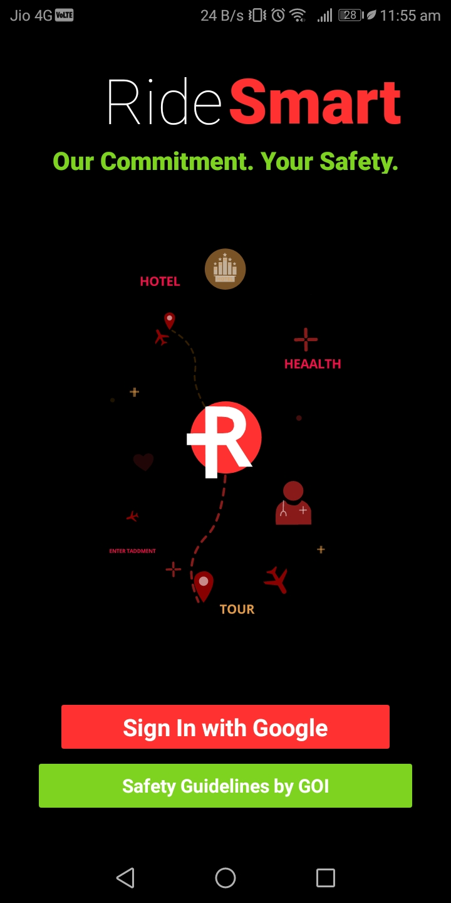
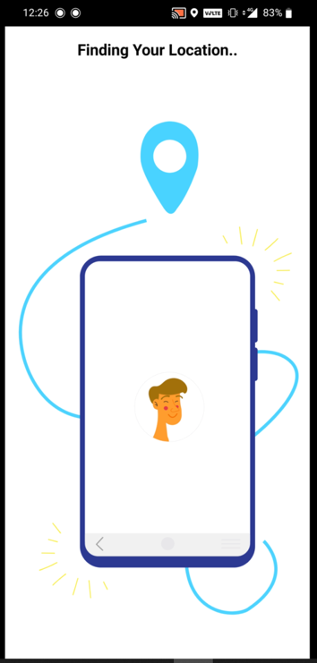
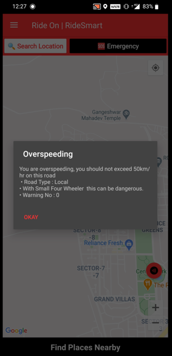
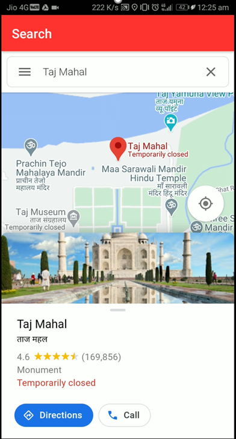
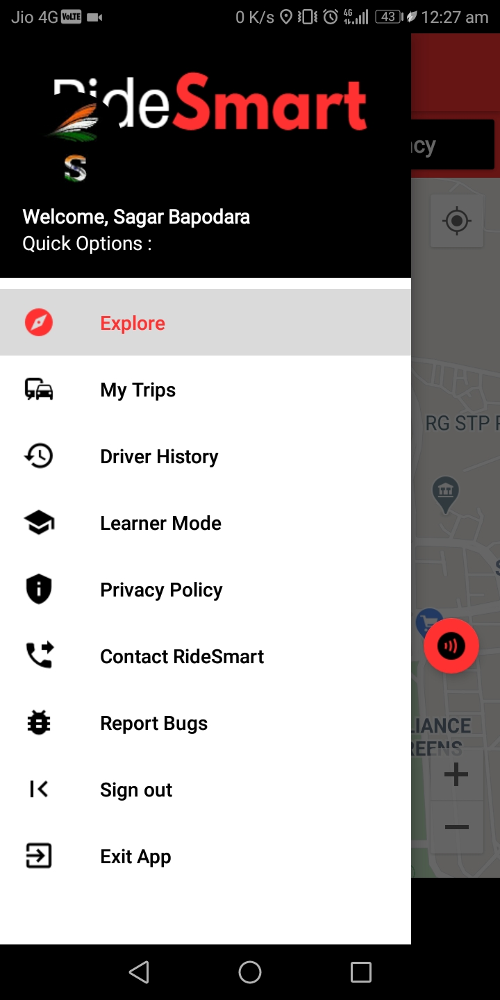

# RideSmart
An Application based software, that can be integrated in cars, that fetches the speed of vehicle and pings user if it's above govt. regulated rules as per the road type, with notification for a penalty. It rates the users according to their past lawless acts in govt's database.

# Disclaimer 

### The App is only for demo purposes, the real system will be integrated in cars. 
### The App is in Beta phase, it may not be able to work on all locations or devices.

### Try the app now online : https://bit.ly/3ksJupO

## Ride Smart ~ Your Safety our Commitment 

### Problem 

Increasing demand for vehicles has exponentially increased the breaking of rules and accidents. The task becomes difficult for the civil body to formulate the regulations on such a large scale. There are 83% of accidents that are due to breaking traffic rules and others are due to drunk driving which also by default includes rash driving.

In Spite of having strong traffic rules worldwide, we are not able to decrease the commonality of the issue. Engaging and analyzing the situation we have come up with a solution.Advanced analysis of speeds at which cars are moving and traffic management is an essential part of safety as it contributes to most of the accidents happening nowadays and is a major component of traffic surveillance systems.

### Solution 

Integrated in-cooperated system in all the vehicles which will keep a track of their speed and notify them when they are over speeding if taken unpretentiously will charge them with a fine which will be directly deducted from their bank account.

Evaluations will be made on the basis of the road on which he/she is driving, as all of us are aware of the speed limits which should not be crossed on certain roads. Further-more this system on a larger scale will also rate the vehicles on the basis of their past records which includes over speeding, accidents, and other fallacious activities. In this way, we will be able to track the activity of other drivers too so that one can know how to cross or drive near them.

All the vehicles will be marked with a safety percentage which will be continuously evaluated on the basis of their driving skills and ethical driving. All the learners can turn on the learner mode, which will make their car visible as a learner thus making it easier for other drivers to drive properly.

With the advancement in technology, the vehicles have integrated touch screen monitors beside the steering wheel which will help us within cooperating with our project with it very easily.

### Technologies Used : 

1. Android
2. Firebase for Backend & Authentication
3. Java
4. Google Maps API
5. Speech Recognition
6. Location Services & Sensors
7. Airtable for Data Storage

## Images from the App 

### Intro Screen : 

### Finding Location : 

### Warning type : 

### Search : 

### Sidebar : 

### Video of Working of the App

https://youtu.be/OA6XqIy5zXA

